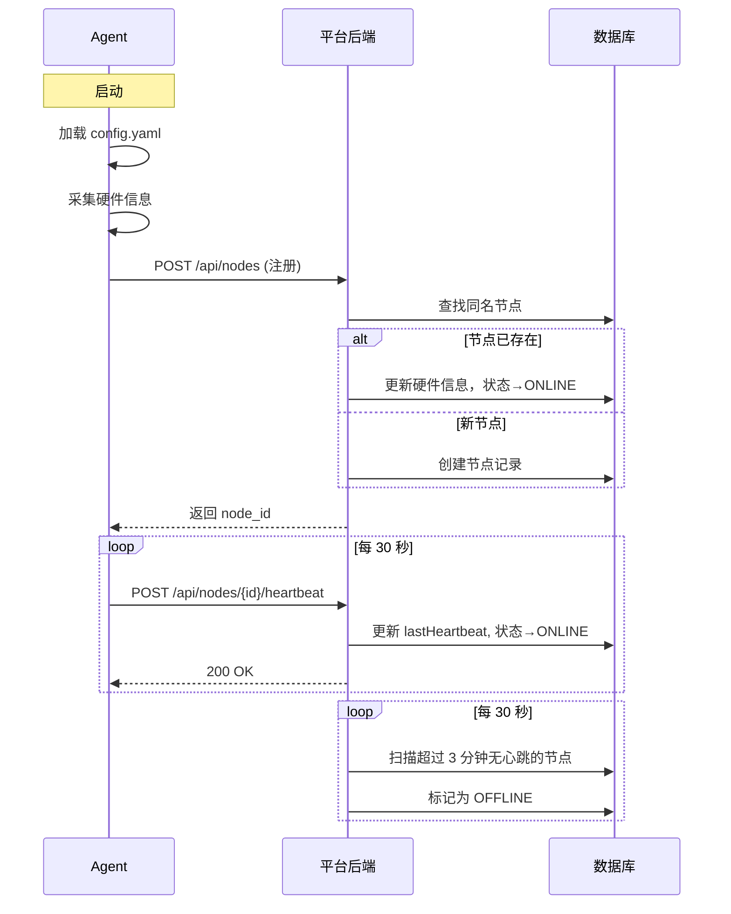
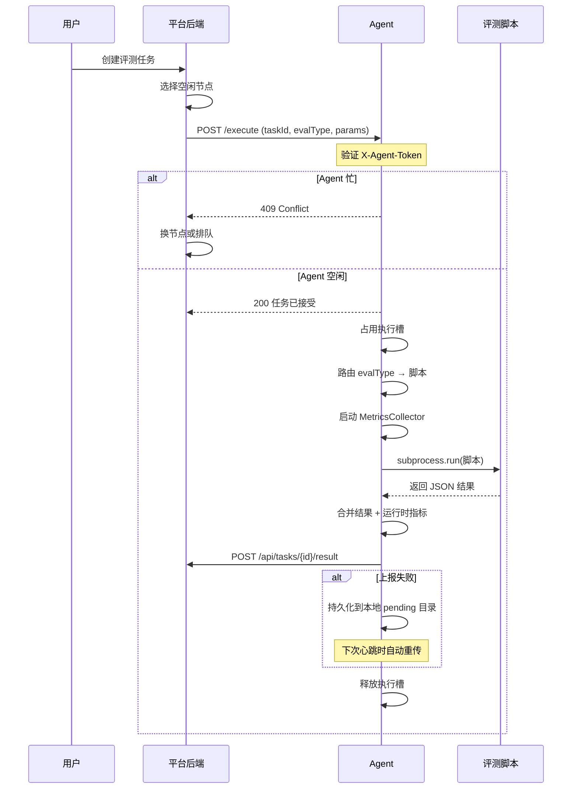

# 计算节点 Agent 技术方案

> 版本：v2.0 | 更新日期：2026-04-06 | 作者：菜菜子

## 1. 概述

计算节点 Agent 是部署在每个计算节点上的常驻服务程序，负责：
- **节点注册**：向平台注册自身，上报硬件信息
- **心跳保活**：定期上报健康状态，维持在线连接
- **任务执行**：接收平台下发的评测任务，调用评测脚本执行
- **指标采集**：采集执行期间的系统资源指标（CPU/内存等）
- **结果上报**：将评测结果和执行日志回传平台

## 2. 架构图

```
┌─────────────────────────────────────────────────────────┐
│                     平台后端 (Spring Boot)               │
│                                                         │
│  ┌──────────┐  ┌──────────┐  ┌──────────┐  ┌────────┐ │
│  │ NodeCtrl │  │ TaskCtrl │  │ResultCtrl│  │Scheduler│ │
│  │ /nodes/* │  │/tasks/*  │  │/results/*│  │(cron)   │ │
│  └────┬─────┘  └────┬─────┘  └────┬─────┘  └───┬────┘ │
│       │              │              │            │       │
│       │    POST /nodes/{id}/heartbeat            │       │
│       │    POST /tasks/{id}/result               │       │
│       │    POST /tasks/{id}/failure              │       │
│       │    @Scheduled checkOfflineNodes (30s)     │       │
└───────┼──────────────┼──────────────┼────────────┼───────┘
        │              │              │            │
   ─────┼──────── HTTP ┼──── API ─────┼────────────┼──────
        │              │              │            │
┌───────┼──────────────┼──────────────┼────────────┼───────┐
│       ▼              ▼              ▼            ▼       │
│  ┌─────────────────────────────────────────────────────┐ │
│  │              Node Agent (Python/Flask)               │ │
│  │                                                     │ │
│  │  ┌───────────┐  ┌──────────┐  ┌──────────────────┐ │ │
│  │  │ Register  │  │Heartbeat │  │  HTTP Server      │ │ │
│  │  │ (启动时)  │  │ Thread   │  │  :8090            │ │ │
│  │  │           │  │ (30s)    │  │                   │ │ │
│  │  │ POST      │  │ POST     │  │ GET  /status      │ │ │
│  │  │ /nodes    │  │ /nodes/  │  │ POST /execute     │ │ │
│  │  │           │  │ {id}/    │  │                   │ │ │
│  │  │           │  │ heartbeat│  └────────┬──────────┘ │ │
│  │  └───────────┘  └──────────┘           │            │ │
│  │                                        ▼            │ │
│  │  ┌──────────────────────────────────────────────┐   │ │
│  │  │           TaskExecutor (线程池)               │   │ │
│  │  │                                              │   │ │
│  │  │  ┌────────────┐    ┌───────────────────┐     │   │ │
│  │  │  │  Metrics    │    │   subprocess.run  │     │   │ │
│  │  │  │  Collector  │    │                   │     │   │ │
│  │  │  │  (采集线程) │    │  eval-scripts/    │     │   │ │
│  │  │  │  CPU/MEM    │    │  ├ cpu_operator_  │     │   │ │
│  │  │  │  2s 采样    │    │  │ benchmark.py   │     │   │ │
│  │  │  │             │    │  ├ cpu_model_     │     │   │ │
│  │  │  │             │    │  │ inference.py   │     │   │ │
│  │  │  │             │    │  └ run_test_      │     │   │ │
│  │  │  │             │    │    cases.py       │     │   │ │
│  │  │  └────────────┘    └───────────────────┘     │   │ │
│  │  │           │                    │              │   │ │
│  │  │           └──── 合并指标 ──────┘              │   │ │
│  │  │                    │                          │   │ │
│  │  │            POST /tasks/{id}/result            │   │ │
│  │  └──────────────────────────────────────────────┘   │ │
│  └─────────────────────────────────────────────────────┘ │
│                    计算节点 (dev-node-01)                 │
└──────────────────────────────────────────────────────────┘
```

## 2.1 时序图


### 节点注册 + 心跳





### 任务执行流程




## 3. 模块设计

### 3.1 Agent 主进程 (`main.py`)

**启动流程：**
1. 加载 `config.yaml` 配置
2. 调用 `register_node()` 向平台注册
3. 初始化 `TaskExecutor`
4. 启动 `HeartbeatThread`（守护线程）
5. 启动 Flask HTTP 服务（:8090）

**HTTP 端点：**
| 端点 | 方法 | 说明 |
|------|------|------|
| `/status` | GET | 返回 Agent 状态、当前任务、系统指标 |
| `/execute` | POST | 接收并异步执行评测任务 |

### 3.2 节点注册 (`register.py`)

**注册流程：**
1. 调用 `collector.get_hardware_info()` 采集硬件信息
2. POST `/api/nodes` 向平台注册
3. 如果节点名已存在，后端返回已有记录（支持重复注册/重启）
4. 返回节点信息（含 node_id），用于后续心跳和任务上报

**注册数据：**
```json
{
  "name": "dev-node-01",
  "description": "开发测试节点",
  "tags": "cpu,dev,centos",
  "agentPort": 8090,
  "hardwareInfo": {
    "hostname": "iZ2zee...",
    "os": "Linux 5.14.0-687.el9.x86_64",
    "arch": "x86_64",
    "cpu_model": "x86_64",
    "cpu_cores_physical": 2,
    "cpu_cores_logical": 4,
    "cpu_freq_mhz": 2500.0,
    "memory_total_gb": 14.67,
    "disk_total_gb": 39.74,
    "disk_free_gb": 16.97,
    "python_version": "3.9.25"
  }
}
```

### 3.3 心跳保活 (`heartbeat.py`)

**机制：**
- 守护线程，每 30 秒发送一次心跳
- POST `/api/nodes/{id}/heartbeat`
- 携带实时系统指标（CPU%、内存%、负载、磁盘）

**后端侧：**
- `ComputeNodeService.heartbeat()` 更新节点状态为 ONLINE、刷新 lastHeartbeat
- `@Scheduled checkOfflineNodes()` 每 60 秒扫描，超过 3 分钟无心跳的节点标记为 OFFLINE

**状态机：**
```
注册 → OFFLINE → (收到心跳) → ONLINE → (接受任务) → BUSY
                                ↑                      │
                                └──── (任务完成) ───────┘
                                
ONLINE/BUSY → (3分钟无心跳) → OFFLINE
任何状态 → (手动维护) → MAINTENANCE
任何状态 → (异常) → ERROR
```

### 3.4 任务执行 (`executor.py`)

**核心组件：TaskExecutor**

**执行流程：**
1. 接收任务请求（taskId, evalType, params）
2. 占用执行槽（单任务串行，防并发）
3. 根据 evalType 路由到对应评测脚本
4. 启动 MetricsCollector 采集线程
5. `subprocess.run()` 执行评测脚本
6. 合并评测结果 + 运行时指标
7. POST `/api/tasks/{taskId}/result` 上报结果
8. 释放执行槽

**脚本路由：**
| evalType | 脚本 |
|----------|------|
| OPERATOR / operator_benchmark | `cpu_operator_benchmark.py` |
| MODEL / model_inference | `cpu_model_inference.py` |
| PERFORMANCE | 动态路由：根据 params 中有 operator 还是 model 参数决定 |

**MetricsCollector：**
- 独立守护线程，2 秒采样一次
- 采集 CPU 使用率、内存使用率
- 任务结束后输出统计摘要（avg/max/min）

### 3.5 指标采集 (`collector.py`)

两个层级：
1. **硬件信息采集** (`get_hardware_info()`) — 注册时一次性采集
2. **实时指标采集** (`get_system_metrics()`) — 心跳时周期性采集
3. **执行期指标** (`collect_during_execution()`) — 任务执行期间密集采集

## 4. 评测脚本

> ⚠️ **MVP 阶段说明**：当前评测脚本为 CPU/NumPy 模拟实现，适用于功能验证和 CI 测试。
> 第二期将替换为 PyTorch/ONNX Runtime 实现，支持真实 GPU 硬件评测。

### 4.1 算子性能基准测试 (`cpu_operator_benchmark.py`)

**支持的算子：**
MatMul, Conv2D, Softmax, ReLU, GELU, SiLU, LayerNorm, BatchNorm, Attention, ScaledDotProduct, Add, Mul, Div, Sub, Exp, Log, Sqrt, Abs, Neg, Clamp, Sigmoid, Tanh, Transpose, Reshape, Concat, Linear, Embedding, Gather

**测试流程：**
1. 解析 CLI 参数（JSON 格式）
2. 对每个算子构造测试 tensor
3. warmup 预热 → N 次迭代计时
4. 输出 JSON 结果：latency (mean/p50/p95/p99/min/max)、throughput、CPU 利用率

**输出格式：**
```json
{
  "test_type": "cpu_operator_benchmark",
  "system_info": { "cpu": "...", "cores": 4, "memory_gb": 14.7 },
  "results": [
    {
      "operator": "MatMul",
      "iterations": 50,
      "latency_ms_mean": 2.23,
      "latency_ms_p50": 2.15,
      "latency_ms_p95": 2.89,
      "latency_ms_p99": 3.12,
      "throughput_ops": 448.4,
      "cpu_util_percent": 98.2,
      "status": "PASS"
    }
  ],
  "summary": { "total": 10, "passed": 10, "failed": 0, "pass_rate": "100%" }
}
```

### 4.2 模型推理测试 (`cpu_model_inference.py`)

**支持的模型（CPU 纯 NumPy 实现）：**
- MLP-Small / MLP-Medium / MLP-Large（多层感知机）
- ResNet-block（残差块模拟）
- BERT-block（Transformer encoder 模拟）

**测试指标：**
- 推理延迟 (ms)、吞吐量 (inferences/s)
- 不同 batch size 下的性能对比

## 5. 通信协议

### 5.1 Agent → 平台

| 接口 | 说明 | 频率 |
|------|------|------|
| POST /api/nodes | 注册节点 | 启动时 1 次 |
| POST /api/nodes/{id}/heartbeat | 心跳上报 | 每 30 秒 |
| POST /api/tasks/{taskId}/result | 上报成功结果 | 任务完成时 |
| POST /api/tasks/{taskId}/failure | 上报失败结果 | 任务失败时 |

### 5.2 平台 → Agent

| 接口 | 说明 | 触发时机 |
|------|------|----------|
| GET http://{node_ip}:{agent_port}/status | 查询 Agent 状态 | 诊断时 |
| POST http://{node_ip}:{agent_port}/execute | 下发评测任务 | 任务调度时 |

### 5.3 认证方式
- Agent → 平台：请求头 `X-Agent-Token: <agent-token>`
- 平台 → Agent：内网通信，暂无额外认证（后续可加 mutual TLS）

## 6. 部署方案

### 6.1 当前部署方式（开发环境）

```bash
# 在计算节点上直接启动
cd /path/to/ai-hardware-verification-platform/agent
pip3 install flask pyyaml psutil requests numpy
nohup python3 main.py > /tmp/agent.log 2>&1 &
```

### 6.2 生产部署建议

使用 systemd 管理 Agent 生命周期：

```ini
# /etc/systemd/system/ahvp-agent.service
[Unit]
Description=AHVP Compute Node Agent
After=network.target

[Service]
Type=simple
User=root
WorkingDirectory=/opt/ahvp/agent
ExecStart=/usr/bin/python3 main.py
Restart=always
RestartSec=10
StandardOutput=journal
StandardError=journal

[Install]
WantedBy=multi-user.target
```

### 6.3 配置文件 (`config.yaml`)

```yaml
platform:
  url: "http://<platform-ip>:8080/api"
  token: "<agent-token>"

node:
  name: "<unique-node-name>"
  description: "节点描述"
  tags: "cpu,gpu,..."

agent:
  port: 8090
  host: "0.0.0.0"

heartbeat:
  interval: 30  # 秒

eval_scripts_dir: "/opt/ahvp/eval-scripts"
project_root: "/opt/ahvp"
```

## 7. 可靠性设计

### 7.1 心跳断线恢复
- Agent 心跳失败时仅 warning，不停止服务
- 后端 3 分钟无心跳标记 OFFLINE，但不删除节点记录
- Agent 重启后自动重新注册 + 恢复心跳

### 7.2 任务执行保护
- 单任务串行（`is_busy` 锁），防止资源竞争
- 执行超时 600 秒自动终止 subprocess
- `finally` 块确保无论成功失败都释放执行槽
- 执行失败通过 `/tasks/{id}/failure` 上报错误详情

### 7.3 结果上报重试
- 上报失败时自动持久化到本地文件 (`/tmp/ahvp-pending-results/{taskId}.json`)
- 心跳线程每次心跳后自动检查 pending 目录并重传
- 重传成功后自动删除本地缓存文件

### 7.4 任务拒绝策略

- Agent 为单任务串行执行模型，同一时间只能执行一个评测任务

- 当 Agent 正在执行任务时，新的 `/execute` 请求返回 **HTTP 409 Conflict**

- 平台收到 409 响应后应：

  - 选择其他空闲节点重新调度

  - 或将任务加入等待队列，稍后重试

- 响应格式：`{"code": -1, "message": "节点忙，正在执行任务 {currentTaskId}"}`


### 7.5 请求认证

- 平台→Agent 的所有 `/execute` 请求必须携带 `X-Agent-Token` header

- Token 值必须与 Agent `config.yaml` 中的 `platform.token` 一致

- `/status` 端点无需认证（用于健康检查）

- 认证失败返回 HTTP 401：`{"code": -1, "message": "认证失败"}`


### 7.6 脚本执行安全

- 评测脚本通过 `SCRIPT_MAP` 白名单映射，不支持动态脚本路径

- 额外路径穿越校验：`os.path.realpath()` 确保脚本在 `eval_scripts_dir` 内

- subprocess 执行超时 600 秒自动终止


## 8. 后续演进方向

| 方向 | 说明 | 优先级 |
|------|------|--------|
| GPU Agent 支持 | 增加 CUDA/ROCm 检测、GPU 评测脚本 | P0（第二期） |
| 任务队列 | 支持多任务排队，替代当前单任务串行 | P1 |
| Agent 自动更新 | 平台下发新版本脚本，Agent 热更新 | P2 |
| 安全加固 | mutual TLS、Token 轮换、脚本签名验证 | P1 |
| 分布式采集 | 支持多节点协同执行同一评测计划 | P2 |
| 容器化 Agent | Docker 镜像部署，简化环境管理 | P1 |
