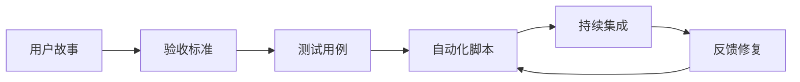

# 🧪 代码测试方法论

## 📋 目录

1. [测试金字塔](#测试金字塔)
2. [测试类型详解](#测试类型详解)
3. [测试原则](#测试原则)
4. [测试流程](#测试流程)
5. [测试用例设计](#测试用例设计)
6. [测试覆盖率](#测试覆盖率)
7. [CI/CD 中的测试](#cicd-中的测试)
8. [测试最佳实践](#测试最佳实践)
9. [常见反模式](#常见反模式)
10. [测试工具选型](#测试工具选型)

---

## 📐 测试金字塔

```
          /\
         /  \
        / E2E \       少量（10%）
       /--------\     用户场景测试
      /          \
     / Integration \  中量（20%）
    /----------------\ 服务间集成测试
   /                \
  /     Unit Tests   \ 大量（70%）
 /--------------------\ 单元测试
```

### 各层级说明

| 层级 | 比例 | 速度 | 成本 | 可靠性 |
|------|------|------|------|--------|
| **单元测试** | 70% | ⚡⚡⚡ 快 | 💰 低 | ✅ 高 |
| **集成测试** | 20% | ⚡⚡ 中 | 💰💰 中 | ✅ 中 |
| **E2E 测试** | 10% | ⚡ 慢 | 💰💰💰 高 | ⚠️ 较低 |

---

## 📊 测试类型详解

### 1. 单元测试（Unit Testing）

**定义**：测试最小可测试单元（函数、方法、类）

**特点**：
- ✅ 隔离测试（Mock 依赖）
- ✅ 快速执行（<10ms/个）
- ✅ 高覆盖率目标（>80%）
- ✅ 开发驱动（TDD）

**示例**（Java/JUnit）：
```java
@Test
@DisplayName("创建任务 - 成功场景")
void createTask_Success() {
    // Given
    TaskRequest request = new TaskRequest("测试任务", "HIGH");
    when(taskRepository.save(any())).thenReturn(new Task(1L, "测试任务"));
    
    // When
    Task result = taskService.createTask(request);
    
    // Then
    assertEquals(1L, result.getId());
    assertEquals("测试任务", result.getName());
    verify(taskRepository, times(1)).save(any());
}
```

**最佳实践**：
- 遵循 AAA 模式（Arrange-Act-Assert）
- 一个测试只验证一个行为
- 使用有意义的测试名称
- 测试应该是确定性的

---

### 2. 集成测试（Integration Testing）

**定义**：测试多个组件之间的交互

**特点**：
- ✅ 验证组件间通信
- ✅ 测试数据库、API、消息队列
- ⚠️ 执行较慢（100ms-1s/个）
- ⚠️ 需要测试环境

**示例**（Spring Boot）：
```java
@SpringBootTest
@AutoConfigureMockMvc
class TaskControllerIntegrationTest {
    
    @Autowired
    private MockMvc mockMvc;
    
    @Autowired
    private TaskRepository taskRepository;
    
    @Test
    @DisplayName("创建任务并查询 - 集成测试")
    void createAndRetrieveTask() throws Exception {
        // Given
        String requestJson = "{\"name\":\"集成测试\",\"priority\":\"HIGH\"}";
        
        // When & Then
        mockMvc.perform(post("/api/tasks")
                .contentType(MediaType.APPLICATION_JSON)
                .content(requestJson))
                .andExpect(status().isCreated())
                .andExpect(jsonPath("$.name").value("集成测试"));
        
        // 验证数据库
        List<Task> tasks = taskRepository.findAll();
        assertEquals(1, tasks.size());
    }
}
```

**测试场景**：
- 数据库 CRUD 操作
- REST API 端点
- 消息队列收发
- 缓存读写
- 第三方服务集成

---

### 3. 端到端测试（E2E Testing）

**定义**：从用户角度测试完整流程

**特点**：
- ✅ 模拟真实用户场景
- ✅ 验证业务流程
- ⚠️ 执行慢（1-10s/个）
- ⚠️ 维护成本高
- ⚠️ 容易脆弱

**示例**（Selenium/Cypress）：
```javascript
describe('任务管理工作流', () => {
  it('完成从创建到删除的完整流程', () => {
    // 1. 登录
    cy.visit('/login');
    cy.get('#username').type('testuser');
    cy.get('#password').type('password123');
    cy.get('button[type="submit"]').click();
    
    // 2. 创建任务
    cy.contains('新建任务').click();
    cy.get('#task-name').type('E2E 测试任务');
    cy.get('#priority').select('HIGH');
    cy.get('button[type="submit"]').click();
    
    // 3. 验证任务列表
    cy.contains('E2E 测试任务').should('be.visible');
    
    // 4. 更新任务状态
    cy.contains('E2E 测试任务').click();
    cy.contains('开始执行').click();
    cy.contains('运行中').should('be.visible');
    
    // 5. 删除任务
    cy.contains('删除').click();
    cy.contains('E2E 测试任务').should('not.exist');
  });
});
```

**适用场景**：
- 关键用户旅程
- 核心业务流程
- 跨系统集成验证
- 发布前回归测试

---

### 4. 其他测试类型

#### 性能测试（Performance Testing）

```java
@Test
@DisplayName("API 响应时间 < 200ms")
void apiResponseTime() {
    long start = System.currentTimeMillis();
    taskService.getAllTasks();
    long duration = System.currentTimeMillis() - start;
    
    assertTrue(duration < 200, "响应时间超过 200ms");
}
```

#### 负载测试（Load Testing）

- 测试系统在高并发下的表现
- 工具：JMeter, Gatling, k6

#### 安全测试（Security Testing）

- SQL 注入测试
- XSS 攻击测试
- 认证授权测试
- 工具：OWASP ZAP, Burp Suite

#### 验收测试（Acceptance Testing）

- 用户需求验证
- BDD（行为驱动开发）
- 工具：Cucumber, SpecFlow

---

## 🎯 测试原则

### FIRST 原则

| 原则 | 说明 |
|------|------|
| **F**ast | 测试要快，避免拖慢开发 |
| **I**ndependent | 测试之间相互独立 |
| **R**epeatable | 任何环境都能重复执行 |
| **S**elf-validating | 自动判断成功/失败 |
| **T**imely | 及时编写（最好在生产代码之前） |

### 其他原则

1. **测试不能证明没有 Bug**
   - 只能证明 Bug 存在
   - 不能证明 Bug 不存在

2. **穷尽测试是不可能的**
   - 基于风险和优先级
   - 使用测试策略

3. **尽早测试**
   - 缺陷发现越早，修复成本越低
   -  Shift Left（测试左移）

4. **缺陷集群性**
   - 80% 的问题集中在 20% 的模块
   - 重点关注核心模块

5. **杀虫剂悖论**
   - 重复同样的测试会失效
   - 需要不断更新测试用例

6. **测试依赖于上下文**
   - 不同系统需要不同的测试策略
   - 没有放之四海而皆准的方法

7. **没有缺陷的谬论**
   - 修复 Bug 不代表系统好用
   - 还要满足用户需求

---

## 🔄 测试流程

### 标准测试流程


### 敏捷测试流程



### 测试驱动开发（TDD）

```
🔴 红：编写失败的测试
  ↓
🟢 绿：编写刚好通过的代码
  ↓
🔵 蓝：重构优化
  ↓
🔴 红：下一个测试
```

**TDD 循环**：
1. 编写一个失败的单元测试
2. 运行测试，确认失败
3. 编写最简单的代码使测试通过
4. 运行测试，确认通过
5. 重构代码
6. 重复循环

---

## 📝 测试用例设计

### 等价类划分

将输入数据分为有效和无效等价类：

| 场景 | 有效等价类 | 无效等价类 |
|------|-----------|-----------|
| 年龄输入 | 18-65 | <18, >65 |
| 用户名 | 3-20 字符 | <3, >20, 特殊字符 |
| 订单金额 | 0.01-10000 | ≤0, >10000 |

### 边界值分析

测试边界条件：

```java
@Test
void testBoundaryValues() {
    // 最小值
    assertValid(age(18));
    
    // 最小值 +1
    assertValid(age(19));
    
    // 正常值
    assertValid(age(40));
    
    // 最大值 -1
    assertValid(age(64));
    
    // 最大值
    assertValid(age(65));
    
    // 最小值 -1（无效）
    assertInvalid(age(17));
    
    // 最大值 +1（无效）
    assertInvalid(age(66));
}
```

### 状态转换测试

```java
@Test
void testTaskStateTransition() {
    Task task = new Task();
    
    // PENDING -> RUNNING
    task.start();
    assertEquals(TaskStatus.RUNNING, task.getStatus());
    
    // RUNNING -> COMPLETED
    task.complete();
    assertEquals(TaskStatus.COMPLETED, task.getStatus());
    
    // COMPLETED -> 不能取消
    assertThrows(IllegalStateException.class, task::cancel);
}
```

### 决策表测试

| 条件 | 规则 1 | 规则 2 | 规则 3 | 规则 4 |
|------|--------|--------|--------|--------|
| 用户登录 | Y | Y | N | N |
| 有权限 | Y | N | - | - |
| **动作** | | | | |
| 显示数据 | ✅ | ❌ | ❌ | ❌ |
| 提示登录 | ❌ | ❌ | ✅ | ✅ |
| 提示无权限 | ❌ | ✅ | ❌ | ❌ |

---

## 📊 测试覆盖率

### 覆盖率类型

| 类型 | 说明 | 目标 |
|------|------|------|
| **语句覆盖率** | 执行了多少行代码 | >80% |
| **分支覆盖率** | 覆盖了多少分支 | >70% |
| **路径覆盖率** | 覆盖了多少路径 | >50% |
| **函数覆盖率** | 调用了多少函数 | >80% |
| **条件覆盖率** | 覆盖了多少布尔条件 | >70% |

### 覆盖率误区

❌ **100% 覆盖率 = 没有 Bug**
- 可能测试了错误的逻辑
- 可能断言不够严格

❌ **覆盖率越高越好**
- 边际效益递减
- 关注关键代码

✅ **合理使用覆盖率**
- 作为参考指标，不是目标
- 核心模块高覆盖率
- 结合代码审查

### 覆盖率工具

| 语言 | 工具 |
|------|------|
| Java | JaCoCo, Cobertura |
| JavaScript | Istanbul, Jest |
| Python | coverage.py, pytest-cov |
| Go | go test -cover |

---

## 🚀 CI/CD 中的测试

### 持续集成流水线

```yaml
# GitHub Actions 示例
name: CI Pipeline

on: [push, pull_request]

jobs:
  test:
    runs-on: ubuntu-latest
    
    steps:
    - uses: actions/checkout@v3
    
    - name: Setup Java
      uses: actions/setup-java@v3
      with:
        java-version: '17'
    
    - name: Run Unit Tests
      run: mvn test
    
    - name: Run Integration Tests
      run: mvn verify -Pintegration
    
    - name: Code Coverage
      run: mvn jacoco:report
    
    - name: Upload Coverage
      uses: codecov/codecov-action@v3
```

### 测试门禁

| 门禁 | 标准 | 动作 |
|------|------|------|
| 单元测试 | 通过率 100% | ❌ 失败则阻断 |
| 集成测试 | 通过率 100% | ❌ 失败则阻断 |
| 代码覆盖率 | >80% | ⚠️ 警告 |
| E2E 测试 | 关键流程通过 | ❌ 失败则阻断 |
| 性能测试 | P95 < 500ms | ⚠️ 警告 |
| 安全扫描 | 无高危漏洞 | ❌ 失败则阻断 |

### 测试环境策略

```
开发环境 → 测试环境 → 预发布环境 → 生产环境
   ↓           ↓           ↓           ↓
单元测试   集成测试    E2E 测试    冒烟测试
```

---

## ✨ 测试最佳实践

### 1. 测试命名规范

```java
// ❌ 不好的命名
@Test
void test1() { }

@Test
void testCreateTask() { }

// ✅ 好的命名
@Test
@DisplayName("创建任务 - 参数为空时抛出异常")
void createTask_WhenNameIsNull_ThrowsException() { }

@Test
@DisplayName("创建任务 - 成功场景返回任务 ID")
void createTask_Success_ReturnsTaskId() { }
```

### 2. 测试数据管理

```java
// ❌ 硬编码测试数据
@Test
void test() {
    User user = new User("张三", "zhangsan@test.com", 25);
}

// ✅ 使用工厂方法
@Test
void test() {
    User user = UserFactory.createValidUser();
}

// ✅ 使用 Builder 模式
@Test
void test() {
    User user = User.builder()
        .name("张三")
        .email("zhangsan@test.com")
        .age(25)
        .build();
}
```

### 3. Mock 使用原则

```java
// ❌ 过度 Mock
@Mock
private TaskRepository taskRepository;

@Mock
private UserService userService;

@Mock
private EmailService emailService;

@Mock
private CacheService cacheService;

// ✅ 适度 Mock
@Mock
private TaskRepository taskRepository;

@InjectMocks
private TaskServiceImpl taskService;
```

### 4. 测试清理

```java
// ✅ 使用 @BeforeEach 和 @AfterEach
@BeforeEach
void setUp() {
    taskRepository.deleteAll();
}

@AfterEach
void tearDown() {
    // 清理资源
}

// ✅ 使用事务回滚
@Test
@Transactional
void test() {
    // 测试完成后自动回滚
}
```

### 5. 参数化测试

```java
// ✅ 参数化测试
@ParameterizedTest
@ValueSource(ints = {18, 25, 40, 55, 65})
void validAges(int age) {
    assertTrue(ageValidator.isValid(age));
}

@ParameterizedTest
@CsvSource({
    "17, false",
    "66, false",
    "0, false",
    "-1, false"
})
void invalidAges(int age, boolean expected) {
    assertEquals(expected, ageValidator.isValid(age));
}
```

---

## ❌ 常见反模式

### 1. 测试依赖

```java
// ❌ 错误：测试之间有依赖
@Test
void test1() {
    // 创建数据
}

@Test
void test2() {
    // 依赖 test1 创建的数据
}

// ✅ 正确：每个测试独立
@Test
void test1() {
    // 自己创建数据
}

@Test
void test2() {
    // 自己也创建数据
}
```

### 2. 测试逻辑复杂

```java
// ❌ 错误：测试中有复杂逻辑
@Test
void test() {
    for (int i = 0; i < 100; i++) {
        if (i % 2 == 0) {
            // 复杂逻辑...
        }
    }
}

// ✅ 正确：测试简单直接
@Test
void test() {
    assertEquals(expected, actual);
}
```

### 3. 测试睡眠

```java
// ❌ 错误：使用 Thread.sleep
@Test
void test() throws Exception {
    Thread.sleep(5000);
    assertEquals(expected, actual);
}

// ✅ 正确：使用 Awaitility
@Test
void test() {
    await().atMost(5, SECONDS)
        .until(() -> service.isReady());
}
```

### 4. 测试范围过大

```java
// ❌ 错误：一个测试验证太多
@Test
void testEverything() {
    // 创建用户
    // 创建任务
    // 执行任务
    // 验证结果
    // 发送邮件
    // ...
}

// ✅ 正确：一个测试验证一个行为
@Test
void createUser_Success() { }

@Test
void createTask_Success() { }

@Test
void executeTask_Success() { }
```

### 5. 忽略测试

```java
// ❌ 错误：随意忽略测试
@Test
@Ignore("以后再修复")
void test() { }

// ✅ 正确：记录原因并跟踪
@Test
@Disabled("等待外部服务修复 - JIRA-1234")
void test() { }
```

---

## 🛠️ 测试工具选型

### Java 生态

| 类型 | 工具 | 说明 |
|------|------|------|
| 单元测试 | JUnit 5, TestNG | 测试框架 |
| Mock | Mockito, EasyMock | 模拟对象 |
| 断言 | AssertJ, Hamcrest | 流畅断言 |
| 集成测试 | Spring Boot Test | Spring 集成 |
| API 测试 | RestAssured | REST API |
| 性能测试 | JMeter, Gatling | 负载测试 |
| 覆盖率 | JaCoCo | 代码覆盖率 |

### JavaScript 生态

| 类型 | 工具 | 说明 |
|------|------|------|
| 测试框架 | Jest, Mocha | 单元测试 |
| E2E 测试 | Cypress, Playwright | 端到端 |
| API 测试 | Supertest | HTTP 测试 |
| Mock | Sinon, Jest Mock | 模拟对象 |
| 覆盖率 | Istanbul | 代码覆盖率 |

### Python 生态

| 类型 | 工具 | 说明 |
|------|------|------|
| 测试框架 | pytest, unittest | 测试框架 |
| Mock | unittest.mock | 模拟对象 |
| Web 测试 | Selenium | 浏览器自动化 |
| API 测试 | requests + pytest | HTTP 测试 |
| 覆盖率 | coverage.py | 代码覆盖率 |

---

## 📋 测试检查清单

### 单元测试检查清单

- [ ] 测试是否独立（不依赖其他测试）
- [ ] 测试是否快速（<10ms）
- [ ] 测试名称是否清晰表达意图
- [ ] 是否遵循 AAA 模式
- [ ] 是否只验证一个行为
- [ ] Mock 是否适度
- [ ] 断言是否明确
- [ ] 是否测试了边界条件
- [ ] 是否测试了异常情况
- [ ] 测试是否可重复

### 集成测试检查清单

- [ ] 是否使用测试数据库
- [ ] 测试数据是否正确清理
- [ ] 是否验证了数据库状态
- [ ] 是否测试了 API 响应
- [ ] 是否测试了错误处理
- [ ] 测试执行时间是否可接受
- [ ] 是否独立于外部服务

### E2E 测试检查清单

- [ ] 是否测试了关键用户旅程
- [ ] 测试是否稳定（不脆弱）
- [ ] 是否有合适的等待策略
- [ ] 测试失败时是否有足够信息
- [ ] 是否在独立环境运行
- [ ] 测试执行时间是否可接受
- [ ] 是否定期审查和更新

---

## 📚 参考资源

### 书籍

- 《测试驱动开发》- Kent Beck
- 《单元测试的艺术》- Roy Osherove
- 《Google 软件测试之道》
- 《持续交付》- Jez Humble

### 在线资源

- Martin Fowler 博客 - https://martinfowler.com/
- Testing JavaScript - https://testingjavascript.com/
- Google Testing Blog - https://testing.googleblog.com/

### 标准

- ISO/IEC/IEEE 29119（软件测试标准）
- ISTQB（国际软件测试认证委员会）

---

**文档版本**: 1.0.0
**创建时间**: 2026-03-30
**最后更新**: 2026-03-30
**作者**: chenxi
